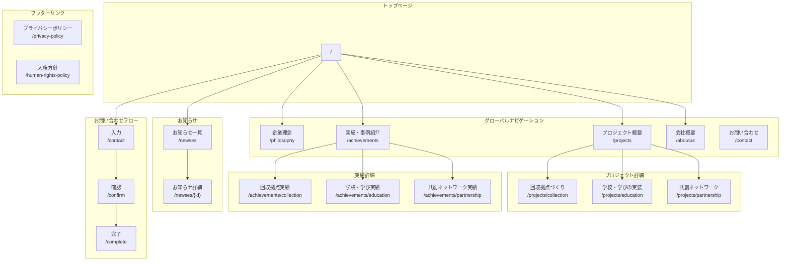
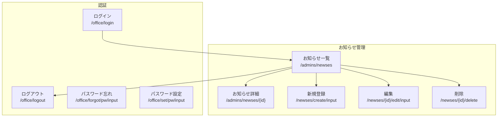

# 株式会社共創 サイトマップ・画面遷移図

## サイト構成図



## 管理者画面



## ページ一覧

### ユーザー向けページ

| # | カテゴリ | ページ名 | URL | ルート名 |
|---|---------|---------|-----|----------|
| 1 | トップ | トップページ | `/` | `indexDev` |
| 2 | 企業理念 | 企業理念 | `/philosophy` | `philosophy` |
| 3 | プロジェクト | プロジェクト概要 | `/projects` | `userServicesShow` |
| 4 | プロジェクト | 回収拠点づくり | `/projects/collection` | `collection` |
| 5 | プロジェクト | 学校・学びの実装 | `/projects/education` | `education` |
| 6 | プロジェクト | 共創ネットワーク | `/projects/partnership` | `partnership` |
| 7 | 実績 | 実績・事例紹介 | `/achievements` | `achievements` |
| 8 | 実績 | 回収拠点実績 | `/achievements/collection` | `achievementsCollection` |
| 9 | 実績 | 学校・学び実績 | `/achievements/education` | `achievementsEducation` |
| 10 | 実績 | 共創ネットワーク実績 | `/achievements/partnership` | `achievementsPartnership` |
| 11 | 会社 | 会社概要 | `/aboutus` | `aboutus` |
| 12 | お知らせ | お知らせ一覧 | `/newses` | `userNewsIndex` |
| 13 | お知らせ | お知らせ詳細 | `/newses/{id}` | `userNewsShow` |
| 14 | お問合せ | お問い合わせ | `/contact` | `contact` |
| 15 | お問合せ | 確認 | `/confirm` | `confirm` |
| 16 | お問合せ | 完了 | `/complete` | `complete` |
| 17 | 法務 | プライバシーポリシー | `/privacy-policy` | `privacy-policy` |
| 18 | 法務 | 人権方針 | `/human-rights-policy` | `human-rights-policy` |

### 管理者向けページ

| # | カテゴリ | ページ名 | URL | ルート名 |
|---|---------|---------|-----|----------|
| 1 | 認証 | ログイン | `/office/login` | `officeLoginInput` |
| 2 | 認証 | ログアウト | `/office/logout` | `officeLogout` |
| 3 | 認証 | パスワード忘れ | `/office/forgot/pw/input` | `officeForgotPwInput` |
| 4 | 認証 | パスワード設定 | `/office/set/pw/input` | `officeSetPwInput` |
| 5 | 認証 | 初期設定 | `/init/input` | `officeInitInput` |
| 6 | 認証 | ワンタイムキー | `/onetime/input` | `officeOnetimeInput` |
| 7 | お知らせ | 一覧 | `/admins/newses` | `officeNewsIndex` |
| 8 | お知らせ | 詳細 | `/admins/newses/{id}` | `officeNewsShow` |
| 9 | お知らせ | 新規登録 | `/newses/create/input` | `officeNewsCreateInput` |
| 10 | お知らせ | 編集 | `/newses/{id}/edit/input` | `officeNewsEditInput` |

## 画面階層構造

```
/（トップページ）
├── /philosophy（企業理念）
├── /projects（プロジェクト概要）
│   ├── /projects/collection（回収拠点づくり）
│   ├── /projects/education（学校・学びの実装）
│   └── /projects/partnership（共創ネットワーク）
├── /achievements（実績・事例紹介）
│   ├── /achievements/collection（回収拠点実績）
│   ├── /achievements/education（学校・学び実績）
│   └── /achievements/partnership（共創ネットワーク実績）
├── /aboutus（会社概要）
├── /newses（お知らせ一覧）
│   └── /newses/{id}（お知らせ詳細）
├── /contact（お問い合わせ）
│   ├── /confirm（確認）
│   └── /complete（完了）
├── /privacy-policy（プライバシーポリシー）
└── /human-rights-policy（人権方針）
```

## ナビゲーション構成

### ヘッダーナビゲーション
- 企業理念
- プロジェクト概要
- 実績・事例紹介
- 会社概要
- お問い合わせ

### フッターリンク
- プライバシーポリシー
- 人権方針
